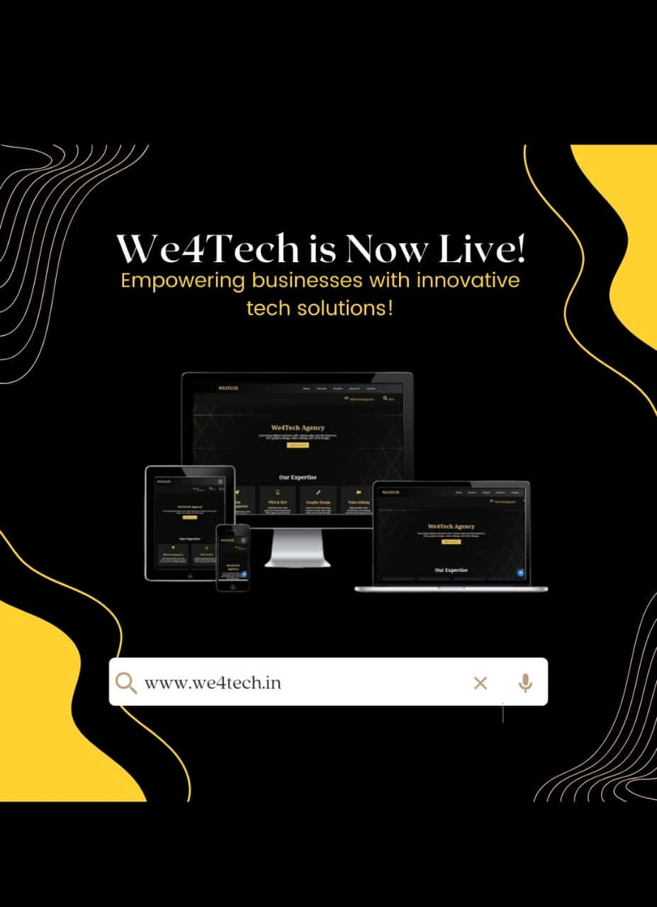

  

# We4Tech Agency 🌐  
Welcome to **We4Tech Agency**, where creativity meets technology!  
We are a dynamic team of passionate developers, designers, and innovators dedicated to crafting exceptional digital experiences.  

---

## 🌟 Who We Are  
At **We4Tech**, we believe in the power of technology to transform ideas into reality. We work collaboratively to deliver high-quality web applications, mobile solutions, and intuitive designs that resonate with users worldwide.  

Our mantra:  
> *"Innovation, Excellence, and Customer Success."*

---

## 👥 Meet the Team  

| **Name**       | **Role**               | **GitHub Profile**                        |  
|-----------------|------------------------|-------------------------------------------|  
| **Hariharanath** | Founder & Lead Developer | [@Hariharanath](#)   |  
| **Guna Teja**   | UI/UX Designer          | [@GunaTeja](#)      |  
| **Anand**       | Backend Specialist      | [@Anand](#)         |  
| **Vedant**      | Frontend Engineer       | [@Vedant](#)        |  
| **Aaran**       | Developer               | [@Aaran](#)       |  
| **Devdat**      | Graphic Designer        | [@Devdat](#)      |  

Together, we aim to create technology that makes a difference.  

---

## 🚀 What We Do  

### 💻 Web Development  
We design and develop scalable, responsive websites tailored to your needs.  

### 🎨 UI/UX Design  
We create intuitive, visually appealing designs that enhance user experiences.  

### 📱 Mobile Applications  
From concept to launch, we build user-friendly mobile apps that solve real-world problems.  

### ⚙️ Software Solutions  
Custom software to optimize workflows and drive business success.  

### 🖌️ Graphic Design  
We craft visually striking assets, from branding to digital art, that leave a lasting impact.  

---

## 🛠️ Technologies We Love  
Here are the technologies we use to bring our projects to life:  

- **Frontend:** HTML, CSS, JavaScript, React.js, Vue.js  
- **Backend:** Node.js, Python, Django, Express.js  
- **Databases:** MongoDB, MySQL, PostgreSQL  
- **Design Tools:** Figma, Adobe XD, Photoshop, Illustrator  
- **Other:** Docker, Kubernetes, AWS, Firebase  

---

## 📂 Explore Our Projects  

- 🌐 **[TechSavvy Website Builder](#)** - Create professional websites effortlessly.  
- 🤖 **[AI Assistant Toolkit](#)** - Simplifying productivity with AI.  
- 📈 **[DataViz Dashboard](#)** - Visualize data like never before.  

*Visit our repositories to see more projects.*  

---

## ✨ Why Choose Us?  
- **Customer-Centric Approach:** We prioritize understanding your needs and exceeding expectations.  
- **Experienced Team:** Years of combined expertise in development and design.  
- **Continuous Innovation:** Keeping up with the latest trends and technologies.  
- **Timely Delivery:** Committed to meeting deadlines without compromising quality.  

---

## 🤝 Get Involved  
### 🌟 Want to Collaborate?  
We’re always excited to work with like-minded individuals and organizations. Feel free to reach out for:  
- Partnerships  
- Open-source contributions  
- Custom project development  

---

## 📧 Contact Us  
- Email: **we4tech@gmail.com**   
- Website: **[We4Tech Official Site](https://we4tech.in/)**)*  
- LinkedIn: **[We4Tech LinkedIn](#)**  

---

## 📜 License  
This organization and its repositories are licensed under the **MIT License**. See the specific repository's license file for details.  

---

### 🌟 A Final Word  
Thank you for visiting **We4Tech Agency**! Together, let’s shape the future of technology. 🚀  
*~ The We4Tech Team*  

  
*(Replace this URL with a footer image link)*  
